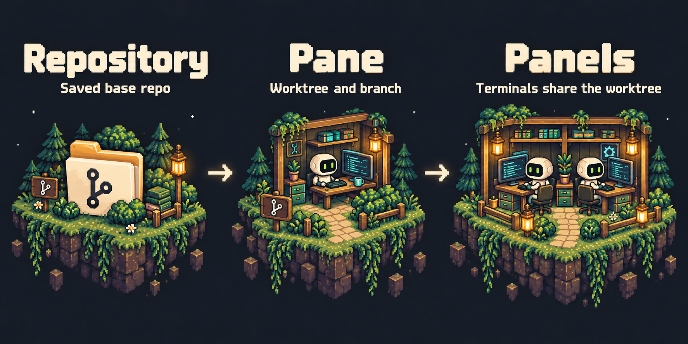

<p align="center">
  
</p>

<p align="center">
  <strong>Run any coding agent, on any OS, from desktop <a href="#remote-pane">or phone</a>.</strong><br>
  <em>just terminals. no abstractions.</em>
</p>

<div align="center">

<a href="https://runpane.com" title="Click on this image to see more themes and demo">
  
</a>

Appearance follows your OS — see [Appearance](docs/APPEARANCE.md).

[](./LICENSE)
[](https://github.com/greenfield-inc/Pane/releases)
[](https://github.com/greenfield-inc/Pane)
[](https://github.com/greenfield-inc/Pane/releases/latest)
[](https://runpane.com/changelog)
[](https://runpane.com)
[](https://discord.gg/BdMyubeAZn)

<br />

**Made possible by our amazing contributors**

<a href="https://github.com/greenfield-inc/Pane/graphs/contributors">
  
</a>

<sub><a href="./CONTRIBUTING.md">Join them</a> and help make Pane better.</sub>

<br />
<br />

**Quick install (recommended)**

<sub>Mac / Linux</sub><br />
<pre><code>curl -fsSL https://runpane.com/install.sh | sh</code></pre>

<sub>Windows (PowerShell)</sub><br />
<pre><code>irm https://runpane.com/install.ps1 | iex</code></pre>

<sub><em>Bypasses the macOS Gatekeeper / Windows SmartScreen prompts on direct downloads.</em></sub>

<br />
<br />

<sub>or download the installer directly</sub><br />
<br />

<a href="https://runpane.com/api/download?platform=mac&source=readme">
  
</a>
<a href="https://runpane.com/api/download?platform=windows&source=readme">
  
</a>
<a href="https://runpane.com/api/download?platform=linux&source=readme">
  
</a>

<br />
<br />

<details>
<summary><sub>Other install methods: npx, pnpm, and pipx</sub></summary>
<br />

<pre><code># Guided setup via npm
npx --yes runpane@latest

# pnpm one-shot
pnpm dlx runpane@latest

# Python tools one-shot
pipx run runpane

# Persistent npm install
npm i -g runpane
runpane setup</code></pre>

</details>

<br />
<br />

[Installation](#installation) · [What Flying Feels Like](#what-flying-feels-like) · [Remote Pane](#remote-pane) · [Workspaces](#pane-workspaces) · [Handoff](#hand-off-a-task) · [Pane Chat](#pane-chat) · [Agent-Operable CLI](#agent-operable-cli) · [Keyboard Shortcuts](#keyboard-shortcuts) · [Building from Source](#building-from-source)

</div>

Not an IDE. Not a terminal emulator. **Vim for agent management.**

Pane manages AI coding agents without replacing them. If it runs in a terminal, it runs in Pane — instantly, with zero integration. Claude Code, Codex, Cursor Agent, Aider, Goose, or any CLI tool. No plugins, no SDK, no waiting for support.

---

## Why Pane Exists

AI coding agents are incredible. Claude Code can work autonomously for hours. Codex can ship features end-to-end. Aider can refactor entire modules. The models are not the bottleneck.

**The way you interact with them is.**

Managing AI agents right now feels like air traffic control with a walkie-talkie. You're juggling terminal windows. Copy-pasting between tabs. Losing track of which agent is on which branch. Alt-tabbing between your diff viewer, your terminal, your git client, and your editor. The agents are fast — but your tools make you slow.

And then there's git worktrees. Everyone agrees worktrees are the right way to run parallel agents — isolated branches, no conflicts, clean separation. But actually using them? It's miserable. `git worktree add`, `git worktree remove`, remembering paths, tracking which worktree is on which branch, cleaning up stale ones, rebasing back to main, squashing commits before merging. Even experienced developers fumble the workflow. It's powerful infrastructure with terrible UX.

Pane makes worktrees invisible. You create a session, Pane creates the worktree. You delete a session, Pane cleans it up. You hit a shortcut, Pane rebases from main. You never type `git worktree` again. All the isolation benefits, none of the pain.

---

## What Flying Feels Like

Each of these is a small thing. Together they compound fast.

| Feature | | |
|---|---|---|
| **Pane Chat** | A global orchestrator terminal that starts in the Pane data directory, loads local Pane orchestration skills, and can coordinate Claude, Codex, or Cursor across repositories, panes, tabs, worktrees, and review loops. | <a href="#pane-chat">Details</a> |
| **Remote Pane** | Run panes, worktrees, terminals, files, git state, and approval prompts on a self-hosted remote machine while controlling them from desktop Pane or the browser app at [runpane.com/app](https://runpane.com/app/). | <a href="#remote-pane">Setup</a> |
| **Pane Workspaces** | Let an agent on one of your machines read files, run commands, and drive Pane on another over Tailscale. Hand off a task to a fresh agent with its branch and a written note. | [Workspaces](#pane-workspaces) · [Handoff](#hand-off-a-task) |
| **Agent-Operable CLI** | Pane ships with `runpane agent-context`, `runpane repos add`, and `runpane panes create`, so a coding agent can discover Pane's command schema, register a repo, open a Pane for each new issue, and add agent tabs to existing Panes for review and fixes (1 feature = 1 worktree = 1 branch = 1 Pane). Claude Code, Codex, and Cursor get the same commands as MCP tools. | [Contract](docs/RUNPANE_CLI_CONTRACT.md) · [MCP](docs/PANE_MCP.md) |
| **@mention Terminals** | Type `@` in any terminal to pull the last 500 lines from another pane's terminal directly into your context, no copy-paste required. |  |
| **Clipboard Shortcuts** | `Ctrl+Alt+[key]` pastes any saved text snippet instantly, so your most-used prompts are one keystroke away forever. |  |
| **Terminal Popover** | Highlight any text in a terminal and an intelligent popover offers the right action: copy, open in browser, or show in explorer. |  |
| **Built-in Browser** | Preview any URL in a tab next to your terminals so every pane can see its own running dev server without alt-tabbing. A new tab, or the address bar's Ports button, lists every port listening on the machine, grouped by the Pane that started it. On your phone, the Remote Pane app opens the same ports and HTML pages over Tailscale ([how](docs/SELF_HOSTED_REMOTE_DAEMON.md#browser-tabs-on-the-phone)), and its Explorer tab browses, edits and previews the worktree's files ([how](docs/SELF_HOSTED_REMOTE_DAEMON.md#files-on-the-phone)). |  |
| **Resource Manager** | Built-in CPU and memory monitor broken down per pane and per process, so you can catch a runaway agent before it eats your laptop. |  |
| **Status Cues** | Every AI pane reports its state at a glance — a red dot when an agent is blocked waiting on your approval, an amber pulse while it works, and a "done" cue when it finishes while you're looking elsewhere. The same rollup colors the project dots and pane tabs, on the desktop and in the phone app, so a whole screen of parallel agents reads in one glance. |  |
| **Jump + Refresh** | Jump to top, jump to bottom, or hard-refresh any terminal from the toolbar to unstick a frozen state in one click. |  |
| **Auto Secrets Copy** | Every pane automatically mirrors `.env` files and secrets from your root project so your worktree is runnable the moment it's created. | |
| **Isolated Ports** | Each pane runs on its own port range automatically, so you can spin up five dev servers in parallel without a single conflict. | |
| **Terminal Rendering Patches** | Claude Code's scroll-jump bug (long conversations snapping to top when you scroll up) is fixed here, even though it's still broken in Claude Code itself. | |
| **Drag and Drop** | Drop any file up to 50MB into a terminal and it lands exactly where you need it. | |

---

## SSH hosts

Pane lists every host in your SSH config (`~/.ssh/config`, or `C:\Users\<you>\.ssh\config` on Windows, plus the files it `Include`s) under **SSH hosts** in the sidebar. Click one and a terminal tab opens with `ssh <host>`, using your own `ssh`, keys and agent. It needs no project, and Pane never reads or copies your keys. Edit the config and the list follows. See [SSH hosts](docs/SSH_HOSTS.md).

---

## Remote Pane

Run agents on a VM, WSL box, home server, desktop, Mac mini, or cloud machine while you keep the Pane UI on your laptop or phone. Remote Pane is self-hosted and open source: the host machine runs the repos, terminals, git state, files, agent credentials, and compute; the client just connects with a `pane-remote://...` code.

The easiest setup path is in the app:

1. Install Pane normally on the machine that should host your projects and agents.
2. Open `Settings > Remote Access` on that host machine.
3. Set it up as a remote host and copy the generated `pane-remote://...` connection code.
4. On another desktop, open Pane, go to `Settings > Remote Access`, paste the code under **Add connection**, and connect.
5. On a phone or tablet, open [runpane.com/app](https://runpane.com/app/), paste the same code, and connect.

A connected desktop reaches the host's dev servers at their usual `localhost` address: browser tabs, terminal links and live reload work as on the host. See [Forwarded ports](docs/SELF_HOSTED_REMOTE_DAEMON.md#forwarded-ports).

For a headless VM or server, run the guided setup in its terminal:

```bash
npx --yes runpane@latest
```

Choose **Set up a remote host**, give it a name, and follow the
Tailscale login prompts. Paste the printed connection code into Pane or
[runpane.com/app](https://runpane.com/app/) on another device signed into the same
Tailscale network.

To skip the menu and run interactive remote setup directly:

```bash
npx --yes runpane@latest install daemon --interactive-tailscale-setup --auto-listen-port
```

pnpm:

```bash
pnpm dlx runpane@latest
```

Python tools:

```bash
pipx run runpane
```

Use SSH instead of Tailscale:

```bash
npx --yes runpane@latest install daemon --label "My Server" --prefer-tunnel ssh
```

The hosted shell installers remain available:

```bash
curl -fsSL https://runpane.com/install-remote.sh | sh -s -- --label "My Server"
```

Windows PowerShell:

```powershell
& ([scriptblock]::Create((irm https://runpane.com/install-remote.ps1))) -Label "My Server"
```

The CLI setup command prints the same connection code and, for SSH mode, the forwarding command. See the [Remote Daemon docs](https://runpane.com/docs/remote-daemon) for the full step-by-step setup, mobile install instructions, API key notes, and security model, or [docs/SELF_HOSTED_REMOTE_DAEMON.md](docs/SELF_HOSTED_REMOTE_DAEMON.md) in this repo.

For agents reaching your own machines from the CLI, see [Pane Workspaces](#pane-workspaces) below.

Integration keys (voice dictation, iPhone notifications) set on one host reach your other hosts through the devices you paired. See [Shared integration keys](docs/SHARED_CREDENTIALS.md).

---

## Pane Workspaces

Your agent can work across your Macs, Windows PCs, and Linux machines. Read a file on your desktop, run a command on your build machine, or check the agents running on your laptop — from the same terminal.

Workspaces use your Tailscale login, without SSH keys or pairing codes. Install and sign in to Tailscale on both machines, enable HTTPS Certificates in the Tailscale admin console (see [setup](docs/RUNPANE_WORKSPACES.md#turning-it-on)), and keep Pane running on the machine you want to reach. Workspaces are on by default for the normal desktop install; `runpane workspace list` shows which machines are answering. Other people's machines on your tailnet appear too, labeled with their owner, and answer when their owner sets Who can connect to Everyone on tailnet. Tagged devices are refused.

Use the npm CLI (`npm i -g runpane`); the Python wrapper does not run workspace commands. Replace `devbox` with a machine name from the list:

```bash
runpane workspace list
runpane workspace devbox read '~/project/README.md'
runpane workspace devbox exec -- 'git --version'
runpane workspace devbox panes list --json
```

Paths belong to the destination machine. `read` and `write` translate Windows and WSL path forms; `exec` uses that machine's shell. Workspaces give your agents file and command access on your joined machines. Run `runpane workspace disable` on a machine that should stop accepting it.

See [Workspaces setup, trust, and troubleshooting](docs/RUNPANE_WORKSPACES.md) for path examples and startup diagnostics. Remote Pane's [pairing codes](#remote-pane) remain the way to connect a desktop or browser UI.

### Hand off a task

“Continue this on my Windows machine with Codex.” `runpane handoff` starts a fresh agent in a new Pane on the other machine (or a new tab in your Pane on this one), using your pushed branch and a note about the task. The note carries the goal, decisions, verified state, and next steps. Live processes and agent session memory stay on the original machine.

Run from the repository you're handing off. On the destination, clone the same GitHub repository if needed and add that checkout to Pane. Install and sign in to the receiving agent there. Keep Pane running there. Use the npm CLI. On the destination, choose a repository outside WSL; WSL receivers are not supported.

From a Bash or Zsh terminal (for example, on your Mac):

```bash
runpane handoff --template > ~/handoff.md
# Fill in every section of the note; use "None" where appropriate.
# Commit and push the task's changes, then check the note and git state:
runpane handoff "codex on devbox" --note-file ~/handoff.md --dry-run
runpane handoff "codex on devbox" --note-file ~/handoff.md
```

You can choose Claude, Codex, or Cursor, with a model and, for Claude or Codex, an effort level. Optional `--push` commits remaining changes except the note as WIP and pushes without forcing, so review your working tree first.

The receiver gets instructions to verify the starting commit, continue the note's next steps, push to your original branch, and report back to your sending panel with `runpane workspace <sender> panels submit`. Stop editing that branch after handing it off. If you sent from outside a Pane panel, the instructions use a PR comment or commit message instead.

See the [handoff guide](main/src/services/paneChatBundle/skills/handoff/SKILL.md) and [CLI options](packages/runpane/README.md#handing-work-to-another-machine).

---

## Pane Chat

Pane Chat is the global orchestrator terminal for a Pane workspace. It is not tied to a repository or worktree. It starts from the Pane data directory, reads a generated local runtime context, and uses the `runpane` CLI to inspect and operate the workspace.

Use it for the work that spans panes:

```text
Add this repo, create three worktree panes for the next features, start Codex in each one, and keep a separate review tab ready for every PR.
```

Pane Chat keeps the human discussion at the orchestrator level, captures work as tickets or briefs, then hands authorized implementation to Claude, Codex, or Cursor agents in Panes through RunPane.

The prompt stays small because Pane ships its skills and installs them into the Pane data directory at startup, whenever the bundled copy has changed:

- `skills/pane-chat/pane-orchestrator/SKILL.md`: the Pane Chat entry point (also in `.claude/skills/`, `.codex/skills/`, and as `.cursor/rules/pane-orchestrator.mdc`)
- `skills/pane-chat/runtime-context.md`: how to reach this Pane install
- `skills/pane-chat/skills/`: the bundled skills, also installed in `.claude/skills/` and `.codex/skills/`
- `.claude/agents/` and `.codex/agents/`: helper subagents (explorer, cold-reader, qa-and-verify, reviewer)

The bundle lives in `main/src/services/paneChatBundle/`. It is built on Agent Farm's raw profile (`prepare-pr`, `create-ticket`, `tdd`, `quick-verify`, `babysit-pr`, `investigate`, and others), general primitives such as `orchestrate-sessions`, `verify-app`, `options`, and `brief`, and two Pane-specific skills, `runpane` and `pane-work`. Pane generates the `pane-orchestrator` entry point at install time. Nothing is downloaded at runtime.

The top-right toggle switches Pane Chat between Claude, Codex, and Cursor and persists the default orchestrator agent in Pane settings. All three use the same Pane-specific contract and the same bundled skills.

---

## Agent-Operable CLI

Pane is not just a place where agents run. It exposes a stable `runpane` CLI contract that agents can use to manage the workspace for you.

For example, you can ask an agent to create panes for a set of GitHub issues and start Codex, Claude Code, Cursor, or any terminal command in each one. The agent can inspect the available Pane commands, register the current repository if needed, and create panes with initial instructions:

```bash
runpane agent-context
runpane repos list --json
runpane repos add --path /path/to/repo --yes --json
runpane panes create --repo active --name issue-252 --agent codex --prompt "Kick off the discussion skill for issue 252" --yes
```

`runpane agent-context` is token-efficient by default and prints only command names, arguments, and safe usage notes. Agents can lazy-load full details for a specific command with `runpane agent-context --command "panes create" --json`.

Pane also registers a `pane` MCP server with Claude Code, Codex, and Cursor, so agents in every repository can get these commands as tools. Cursor may ask you to approve the server. The default core toolset covers the common jobs in one call each: start an agent on a task, check on it, and send it a follow-up. It also has git status, docs search, and `pane://` links that open a Pane in the app. You can turn this off, or register every tool, in Settings → AI & Agents. Other MCP clients (VS Code and any stdio client) can run `npx --yes runpane@latest mcp`. See [Pane MCP Server](docs/PANE_MCP.md).

Pane teaches agents about RunPane without editing your repositories. It installs a small Pane-managed `pane` skill in your home skill folders (`~/.claude/skills/pane`, or under `CLAUDE_CONFIG_DIR`, and `~/.agents/skills/pane`), including saved WSL distros on Windows. The skill is marked `<!-- pane-managed-skill v1 -->`. Pane never overwrites or removes a skill it did not write, and **Settings → AI & Agents → Install Pane skill for agents** removes it again.

Publishing a Pane section into each repository's `AGENTS.md` is still available under **Settings → AI & Agents → Publish Pane instructions to AGENTS.md**, but it is off by default because it edits files in your repositories. Upgrading turns it off once and removes only Pane's marked section; turning it back on afterward sticks.

See [Runpane CLI Contract](docs/RUNPANE_CLI_CONTRACT.md) for the full schema and automation examples.

---

## How It Works



Two primitives: **panes** and **tabs**. One pane per feature, one worktree each. Inside every pane, everything lives in tabs — agents, diff viewer, file explorer, git tree, logs, multiple terminals. Create a pane, get an isolated workspace. Delete a pane, everything cleans up. Your agents never step on each other, and every tab persists across restarts.

Your agents already talk to Linear, Jira, GitHub, and Slack through MCPs and CLI tools. The terminal is the universal integration layer. Pane doesn't re-integrate what your agents already access — it gives them a place to run.

Pane also lets those agents operate the workspace itself. With the `runpane` CLI, an agent can list saved repositories, register a new repo, create panes, open terminal-backed agent tabs, and seed the first prompt. That means "set up panes for these issues and start the discussion skill" can be one instruction, not a manual UI checklist.

Other tools build custom chat UIs that only work with agents they've explicitly added support for. Pane gives every agent a real terminal. "Future CLI agent support" isn't a roadmap item here — it's the default. You bring the agents, Pane makes them fly.

---

## Keyboard Shortcuts

| Shortcut | Action |
|----------|--------|
| `⌘⇧P` / `Ctrl+Shift+P` | Open command palette |
| `⌘K` / `Ctrl+K` | Clear terminal scrollback |
| `⌘N` / `Ctrl+N` | New pane |
| `⌘⇧W` / `Ctrl+Shift+W` | Archive pane |
| `⌘1-9` / `Ctrl+1-9` | Switch pane |
| `⌘,` / `Ctrl+,` | Open settings |
| `⌘⌥<key>` / `Ctrl+Alt+<key>` | Paste a clipboard shortcut into the active terminal |
| `⌘⌥/` / `Ctrl+Alt+/` | Open Settings → Shortcuts |
| `⌘⌥` (hold) / `Ctrl+Alt` (hold) | Show all configured shortcuts as an overlay |
| `⌘B` / `Ctrl+B` | Toggle sidebar |

---

## Installation

### Quick Install

Run the guided setup:

```bash
npx --yes runpane@latest
```

The wizard can install Pane on this machine, configure this machine as a remote
host, update Pane, or run diagnostics. For remote access, choose **Set up a remote
host**, accept or enter a name, and follow the Tailscale login
prompts. Copy the connection code into Pane on your other device or
[runpane.com/app](https://runpane.com/app/). Sign that device into the same
Tailscale network first. No tunnel flags are needed in the wizard.

### Package Manager Commands

Explicit desktop install:

```bash
npx --yes runpane@latest install client
pnpm dlx runpane@latest install client
pipx run runpane install client
```

The shell installers and the other one-shot commands are at the top of this README.

### Direct Download

> **[Download the Latest Release](https://github.com/greenfield-inc/Pane/releases/latest)**

| Platform | File |
|----------|------|
| Windows (x64) | `Pane-x.x.x-Windows-x64.exe` |
| Windows (ARM64) | `Pane-x.x.x-Windows-arm64.exe` |
| macOS (Apple Silicon) | `Pane-x.x.x-macOS-arm64.dmg` |
| macOS (Intel) | `Pane-x.x.x-macOS-x64.dmg` |
| Linux (x64) | `Pane-x.x.x-linux-x86_64.AppImage` or `.deb` |
| Linux (ARM64) | `Pane-x.x.x-linux-arm64.AppImage` or `.deb` |

### Requirements

- **Git** installed and available in PATH
- At least one AI coding agent CLI installed:
  - [Claude Code](https://docs.anthropic.com/en/docs/claude-code) — `npm install -g @anthropic-ai/claude-code`
  - [Codex](https://github.com/openai/codex) — `npm install -g @openai/codex`
  - [Cursor Agent](https://cursor.com/docs/cli) — `curl https://cursor.com/install -fsS | bash` (macOS/Linux, or inside WSL on Windows)
  - [Aider](https://aider.chat/) — `pip install aider-chat`
  - [Goose](https://github.com/block/goose) — or any other CLI agent

---

## Usage

1. **Open Pane** and create or select a project (any git repository)
2. **Create a pane** — enter a prompt and pick your agent
3. **Add tabs** — launch a Claude, Codex, Cursor, or OpenCode terminal, diff viewer, file explorer, or any CLI tool
4. **Work in parallel** — create multiple panes for different approaches
5. **Review diffs** — see what changed with the built-in diff viewer
6. **Ship** — commit, rebase, and merge from keyboard shortcuts

OpenCode's native terminal preset preserves its exact conversation ID when you reopen a project. OpenCode is not yet available as a Pane Chat or named Session agent.

You can reuse an archived or deleted pane's name. Pane keeps any old worktree
identity and Git branches separate, choosing a free worktree name for the new
pane. Creation errors appear in a dismissible error dialog on desktop and Remote
Pane even if the creation dialog has already closed.

New native archive requests save cleanup intent alongside the archived state. Cleanup
resumes after a restart, keeps Git branches, and never imports historical
archives as deletion requests. The Archive Tasks area retains failure reasons
and offers **Retry cleanup**. Restore waits until cleanup finishes so it cannot
reuse a path that is still being deleted. An interrupted archive script is not
replayed; its retry button explicitly skips that script. Native worktrees are
moved to a private quarantine before files are removed in small batches. Busy
operations retry up to three times; cross-volume renames, locked worktrees,
and identity mismatches preserve the remaining files and show a failure.
Cleanup also waits for known terminal and run-command processes to exit.
If termination fails, the job retains their identities across restart and
**Retry cleanup** retries termination before removing files.
WSL worktrees retain the existing Git cleanup route without restart recovery.
Unsupported native paths fail before archiving. A CLI wait timeout does not
cancel a persisted job. Individual filesystem calls are awaited; batch budgets
bound work between yields, not the time an operating-system call can take.

Leaderboard submissions use the selected runtime's last 30 days of agent usage,
matching the Usage page's source. When connected to a remote backend, Pane submits that
backend's totals under the desktop app's existing leaderboard identity. If the
backend is unavailable, the submission fails rather than using desktop totals.

---

## The Windows Problem

The Windows developer experience for AI coding tools is broken across the board:

- **Claude Desktop on Windows** crashes repeatedly. Requires manual Hyper-V and Container feature enablement. Windows App Runtime dependencies aren't auto-installed.
- **Claude Code on Windows** is non-functional when your Windows username contains a period — standard in enterprise Active Directory environments.
- **Conductor** is Mac-only. No Windows version exists. The founder publicly said Windows support is "hopefully soon-ish."
- **Claude Squad** has a hard dependency on tmux, which doesn't exist on Windows.
- **Claude Code Agent Teams** requires tmux or iTerm2 for split panes. Explicitly not supported in VS Code terminal or Windows Terminal.

Windows has roughly 70% of the developer desktop market. Linux has another 5-10%. Mac has about 25%. The entire AI coding tool ecosystem is building for that 25%.

Pane is for the other 75%. And for Mac developers who want to choose their own agents.

---

## Who Pane Is For

- **Developers on any OS**: Mac, Windows, and Linux are all first-class citizens, with no "Mac-first with a Windows waitlist"
- **Multi-agent users** who run Claude Code, Codex, Cursor, Aider, or Goose depending on the task and want one app to manage them all
- **Keyboard-driven developers** who want Superhuman-level speed in their AI-assisted coding workflow
- **Teams** where different engineers use different agents and need a consistent workflow layer
- **Anyone tired of juggling terminal windows**, alt-tabbing between diff viewers and git clients, or waiting for agents one at a time

## What Pane Is Not

Pane is not your editor. Not your terminal. Not your agent.

It replaces the chaos. The twelve terminal windows. The alt-tabbing. The mental overhead of tracking which agent is on which branch. The frustration of tools that don't work on your OS.

Pane replaces the mess with a single, fast, keyboard-driven surface. It's the thing you wish tmux was.

---

## How Pane Is Different

| | Pane | Superset | Conductor | Claude Squad | Cursor/Windsurf |
|---|---|---|---|---|---|
| **Platform** | Win + Mac + Linux | Mac (unofficial Win/Linux) | Mac (Apple Silicon only) | Unix (tmux) | Win + Mac |
| **Agents** | Any CLI | Any CLI | Claude + Codex | Any (tmux) | Built-in only |
| **Diff Viewer** | Built-in, syntax-highlighted | Built-in | Built-in | None | Editor-level |
| **Git Workflow** | Commit, push, rebase, squash, merge — all keyboard | Worktrees + merge | Worktrees + PR | Worktrees only | Editor-level |
| **Keyboard-First** | Every action | Partial | Partial | Terminal only | IDE shortcuts |
| **Open Source** | Yes (AGPL-3.0) | Yes (Apache-2.0) | No | Yes | No |
| **Session Persistence** | Yes | Yes | Yes | No | N/A |

Every tool in the AI coding space either only works on Mac, only works with one agent, is a terminal hack that requires tmux, treats Windows as an afterthought, or wants to be your editor, your terminal, and your agent all at once.

Pane is the only tool that is a real desktop app, agent-agnostic, cross-platform with every OS as a first-class citizen, keyboard-first, and git-native. That combination doesn't exist anywhere else.

---

## FAQ

**"Isn't this just tmux with extra steps?"**
tmux is from 2007. Pane is a modern desktop app with a built-in diff viewer, file explorer, git workflow, command palette, browser tab, resource manager, persistent state, cross-terminal context sharing, and (unlike tmux) it works on Windows. tmux is a terminal multiplexer; Pane is a workstation for managing AI coding agents.

**"What if a new AI agent comes out tomorrow?"**
You just run it. Pane doesn't bundle agents or lock you in. If it runs in a terminal, it runs in Pane, instantly. No plugins, no SDK, no waiting for support.

**"Do I have to know how git worktrees work?"**
No. Pane creates and tears down worktrees automatically when you create or delete a pane, so you get all the isolation benefits without ever typing `git worktree`.

**"Can I run multiple agents in parallel without them stepping on each other?"**
Yes. Each pane gets its own worktree, its own port range, and its own copy of your secrets. Five agents, five isolated workspaces, zero conflicts.

**"Why is it called Pane?"**
Because you look through a pane to see what's happening. Each pane is a window into an agent's work.

**"Why Electron?"**
Pane uses xterm.js, the same terminal engine that powers VS Code's integrated terminal. Same rendering, same reliability. Electron also powers VS Code, Slack, Discord, and Figma.

---

## Building from Source

```bash
git clone https://github.com/greenfield-inc/Pane.git
cd Pane
pnpm run setup
PANE_DIR=~/.pane_test pnpm dev
```

You need Node 22.18 or newer and pnpm 10 (`corepack enable`). `PANE_DIR` keeps
the dev build away from an installed Pane's data in `~/.pane`. It doesn't
isolate Electron's browser profile; see
[Running a dev build safely](CONTRIBUTING.md#running-a-dev-build-safely).

### Production Builds

```bash
pnpm build:win:x64    # Windows (x64)
pnpm build:win:arm64  # Windows (ARM64)
pnpm build:mac        # macOS (Apple Silicon + Intel)
pnpm build:linux      # Linux (x64 + ARM64)
```

### Releasing

Maintainers: see [RUNBOOK.md](RUNBOOK.md).

---

## License

[AGPL-3.0](LICENSE) — Free to use, modify, and distribute. If you deploy a modified version (including as a service), you must open source your changes.

---

<p align="center">
  <sub>Built by <a href="https://dcouple.ai">Dcouple Inc</a></sub>
</p>
