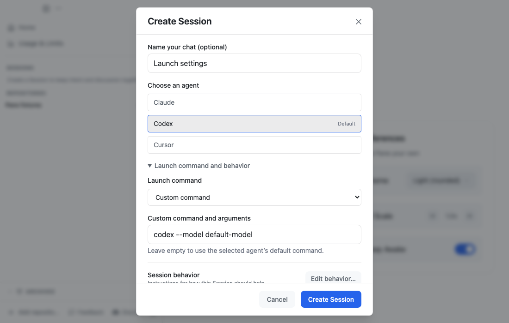
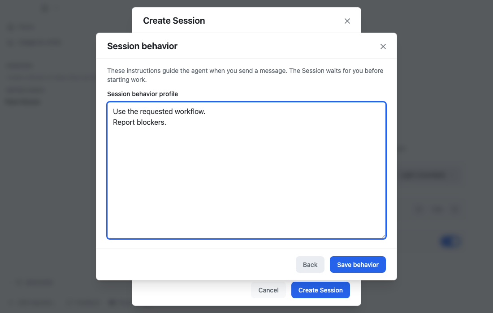

# Session management brief

Status: implemented following user approval; available for evaluation.

## Outcome

A Session is a persistent orchestration conversation with its own managed
scratch workspace. It launches like a normal Pane panel and waits for the
user's message. Users can choose their agent, custom launch command and
arguments, and behavior profile. All agent panels can discover Pane's
coordination tools; their role and authorized task determine how they use them.

## Problem

Today, Session launch injects an initialization prompt and the generated guide
instructs the agent to perform setup and respond. Opening a Session therefore
starts an agent turn before the user asks for anything. Session terminals also
share Pane's application directory, use hardcoded agent launch templates, and
inherit an opinionated workflow from the orchestration guide.

This couples starting a process, loading context, choosing behavior, and
authorizing work. It also makes Session launch configuration less flexible
than ordinary panels in a project or worktree.

## Agreed requirements

### 1. Opening a Session does not start agent work

- Create, open, restore, and agent-switch flows launch or reconnect the
  terminal without submitting a bootstrap message or generating a greeting.
- Orchestration instructions are available to the agent when the user sends
  their first message. Loading these instructions must not require an agent turn.
- Saved goals, blockers, and next actions are context, not authorization to
  continue work automatically.
- Reopening a running Session reconnects to its existing process; it does not
  interrupt authorized work already underway or start an additional turn.
- Pane may prepare files and terminal infrastructure during launch. Model-led
  diagnostics, workspace sweeps, and watcher setup do not run merely because
  the Session was opened.

### 2. Session launch has parity with ordinary panels

- Reuse the launch controls and backend used by panels in projects and
  worktrees, including built-in presets, saved custom commands, and custom
  launch arguments.
- Support an application default and a per-Session selection or override.
- Persist the effective launch configuration for subsequent launches.
- Preserve user arguments. Add context or resume configuration only through
  a compatible launch adapter; do not append native agent flags blindly to
  wrapper commands.
- Support Agent Farm through custom commands in the initial scope. A dedicated
  Agent Farm profile picker is optional follow-up work.
- A user-supplied command can itself request immediate work. The idle guarantee
  means Pane adds no unsolicited prompt or auto-continue action; it does not
  silently strip explicit behavior from the user's command.

### 3. Each Session owns a working directory

- Allocate a unique directory under `<PANE_DIR>/sessions/<session-id>/`.
- Use it as the working directory for the Session's agent and supporting files.
- Keep its path stable across renames, restarts, and agent changes.
- Store Session notes, attachments, generated instructions, and artifacts there.
- Keep project implementation in the relevant Pane/worktree. A Session may
  coordinate work across several repositories without becoming one of them.
- A separate working directory provides organization, not a security sandbox.

### 4. Keep launch settings, behavior, and context separate

| Layer | Responsibility |
| --- | --- |
| Launch configuration | Command, arguments, supported environment settings, agent identity, and resume handling |
| Behavior profile | Role, workflow preferences, and selected instructions or skills |
| Session context | Goal, decisions, notes, blockers, next action, associations, and outputs |
| Pane capability context | Stable identity, relationships, available tools, and command discovery |

Provide an editable default Session profile and per-Session customization.
Pane's generic behavior must work without any particular installed skill,
ticket system, model, or Agent Farm profile. User-selected workflows may add
those conventions.

### 5. Shared capabilities, role-specific defaults

All agent panels should receive the same supported Pane capability surface
for discovering and interacting with Sessions, Panes, panels, repositories,
and worktrees. Reuse supported operations rather than introducing a second
coordination API. Expose missing identity or relationship context where needed.

| Context | Default responsibility |
| --- | --- |
| Session orchestrator | Discuss intent and coordinate relevant Panes when the authorized task calls for it |
| Agent in an associated Pane | Complete assigned work and report progress, results, or blockers to its owning Session |
| Agent in an independent Pane | Work within its Pane; coordinate elsewhere when requested |

Reporting to an owning Session is normal participation. Creating workers,
sending assignments, redirecting another agent, or changing ownership is
management and requires user authorization or an explicitly delegated task
that includes that authority. Authorization persists within its scope; agents
should not repeatedly ask permission for already-authorized steps.

Tool availability does not imply unrestricted authority or automatic sharing
of every conversation. Provide local identity and relationships by default;
retrieve other context as needed. Preserve existing association conflict
checks and do not silently reassign another Session's Pane.

## Proposed generic Session profile

> You are the user's coordination assistant within Pane.
>
> Wait for the user's first message. Opening or restoring this Session does
> not authorize starting or resuming work.
>
> Help the user understand problems, explore options, make decisions, and
> carry out requested work. Answer directly when coordination is unnecessary.
>
> Use Pane's tools to discover relevant repositories, Panes, panels, and
> Sessions when needed. Reuse suitable existing workspaces and preserve
> their ownership and associations.
>
> When authorized work benefits from delegation, coordinate it through
> associated Panes. Pass clear objectives, relevant context, constraints,
> and completion criteria. Avoid duplicating active work.
>
> Keep project implementation in its appropriate Pane. Use this Session's
> workspace for notes, plans, research, and supporting artifacts.
>
> Follow the user's chosen skills and workflows when applicable. If none are
> configured, use a straightforward approach appropriate to the task.
>
> Preserve important decisions, progress, blockers, and outputs for later
> continuation. Distinguish observed results from agent reports, and verify
> outcomes before declaring completion.
>
> Manage only work within the user's authorized scope. Ask when a missing
> decision materially affects the result.

## Recommended defaults for evaluation

- Retain Session folders across archival. Remove them only through explicit
  Session deletion; do not use OS temporary-directory cleanup.
- Start without Git initialization in scratch folders.
- Apply default-profile changes to new Sessions. Existing Sessions retain
  their saved configuration until the user explicitly updates it.
- Apply launch configuration changes on the next explicit restart, with a
  clear indication when changes are pending.
- Keep agent transcripts separate when switching agents, while preserving
  shared Session identity, context, artifacts, and associations.

These are proposed defaults, not a requirement to build a new deletion flow,
profile marketplace, or profile synchronization system in this change.

## Compatibility and implementation investigation

Before finalizing the implementation plan, verify:

1. Each supported built-in agent can receive role and capability context
   without submitting a turn, including on resume.
2. Agent Farm and other supported wrappers preserve user arguments, underlying
   agent identity, and resume behavior. Arbitrary commands must still launch;
   unsupported automatic context/resume integration should be explicit rather
   than silently injecting a prompt or changing the command.
3. Existing Sessions can migrate without losing conversation discovery,
   history, associations, or artifacts when their working directory changes.
   Never move the shared Pane data directory into an individual Session.
4. Instruction discovery in the new directory does not accidentally inherit
   obsolete startup instructions from ancestor directories or duplicate
   conflicting generated guidance.
5. UI, daemon, IPC, and RunPane callers share the same launch/configuration
   behavior, with backward-compatible handling of older records.
6. Pane already exposes the coordination operations needed by each role;
   distinguish missing tool access from missing documentation or context.

Retain stable Session and conversation identifiers where supported. Migration
must be restart-safe and must not mutate a running agent's working directory.
Keep Session creation and directory allocation recoverable after partial failure.

## Acceptance criteria

- Creating a default Session opens an agent ready for input with no injected
  message, model-generated greeting, or agent tool calls before user input.
- Reopening, restoring, restarting, and switching agents do not submit an
  automatic task or replay the old bootstrap prompt.
- On the first user message, a supported agent has its Session identity,
  orchestration role, and Pane tool discovery instructions available.
- Two Sessions have distinct working directories. Renaming or reopening
  either preserves its directory and artifacts.
- A user can select a saved custom command and supply launch arguments using
  the same configuration affordances as a normal project/worktree panel.
  Configuration survives restart and arguments retain their intended meaning.
- Built-in launches and the supported Agent Farm launch path are verified for
  idle startup, context availability, and resume behavior.
- A Session works with the generic default profile and no optional workflow
  skills installed; custom profile instructions are also respected.
- Worker agents can discover Pane tools and report to their owning Session.
  Default guidance keeps them from managing unrelated work without authority;
  explicitly authorized coordination remains possible.
- Existing conversation history, saved context, and associations remain
  accessible after migration. Archive/restore retains Session artifacts.
- Documentation and generated guides describe the new behavior consistently;
  no remaining startup path requires a greeting or unsolicited initialization.

Use lifecycle and launch tests for deterministic guarantees, plus isolated
agent smoke checks for instruction loading and role behavior. Prompt guidance
alone is not a technical access-control guarantee.

## Scope boundaries

The initial change includes idle startup, per-Session directories, shared launch
configuration with custom arguments, editable default behavior, common Pane
capability guidance, and migration/verification of existing Sessions.

It does not require a new permission system, transcript merging, autonomous
background scheduling, a full Claude-style project knowledge system, an Agent
Farm dependency, or mandatory ticket/planning/review workflows. Existing
explicitly authorized background work remains separate from opening a Session.

## Code and reference points

- `main/src/services/orchestrationSessionManager.ts`: Session creation,
  working directory, hardcoded command selection, and injected startup input.
- `main/src/services/paneChatManager.ts`: legacy chat launch compatibility.
- `main/src/services/terminalPanelManager.ts`: terminal environment, input
  delivery, agent launch, and resume handling.
- `main/src/services/skillCacheManager.ts`: generated orchestration guidance.
- `shared/types/orchestrationSession.ts`: persisted Session contract.
- `frontend/src/components/PaneChatView.tsx` and
  `frontend/src/components/OrchestrationSessionNav.tsx`: Session UI.
- `frontend/src/components/panels/PanelTabBar.tsx` and
  `frontend/src/components/SessionView.tsx`: existing panel launch affordances.
- `docs/SESSIONS.md`: current user-facing behavior to update during implementation.
- [Superset Sessions](https://docs.superset.sh/workspaces): managed scratch
  directories with ordinary workspace capabilities.
- [Superset creation implementation](https://github.com/superset-sh/superset/blob/main/packages/host-service/src/trpc/router/workspace-creation/procedures/create-session.ts):
  independent Session allocation and optional agent/command dispatch.
- [Claude Projects](https://support.claude.com/en/articles/9519177-how-can-i-create-and-manage-projects):
  reusable instructions and reference context separate from individual chats.

## Review decision

Implementation was authorized after review of this brief. The changes are ready for review.

## Implementation validation

- Root lint and typecheck pass; the main build passes, including sandboxed preload verification.
- 259 focused backend tests pass, with one Windows-only skip. The 65 tests
  affected by the final lifecycle/cleanup adjustments were rerun and pass.
- All 12 Session UI tests pass using mocked Electron and an isolated Vite server.
- RunPane CLI contract checks pass (an initial daemon-watch timeout passed on retry).
- Native Claude and Codex launched idle. First-message smoke checks recognized
  the custom profile and Session role without reading files through tools.
- Claude resumed history across directories and recognized the destination
  profile. Codex did likewise with an explicit managed `--cd` on resume.
- An installed Agent Farm planner launch recognized the Session profile and ID;
  its prepared interactive command had no initial message.
- Independent review found no remaining blocking issues after fixes for empty
  Claude histories, cross-agent IDs, worker instruction delivery, profile staging,
  and Codex directory selection.

Cursor's CLI was unavailable, so live Cursor startup/resume is unverified;
its launch and instruction-generation paths have automated coverage. Custom
wrappers own their resume flags and must support project instruction files.
Existing files in the formerly shared Pane directory are left in place because
ownership cannot safely be inferred; new Session artifacts use the dedicated
folder. No database schema or dependency manifest changes were required.

## Evaluation refinements

- Keep creation compact and edit the behavior profile in a separate dialog.
  Back discards the draft; Save behavior applies it to the surrounding form.
- Keep action buttons visible at small window heights.
- Distinguish Sessions and Worktrees in Archived, including empty sections,
  and refresh both collections when opened.
- Verified all 12 UI tests, lint, and typecheck after these refinements.

