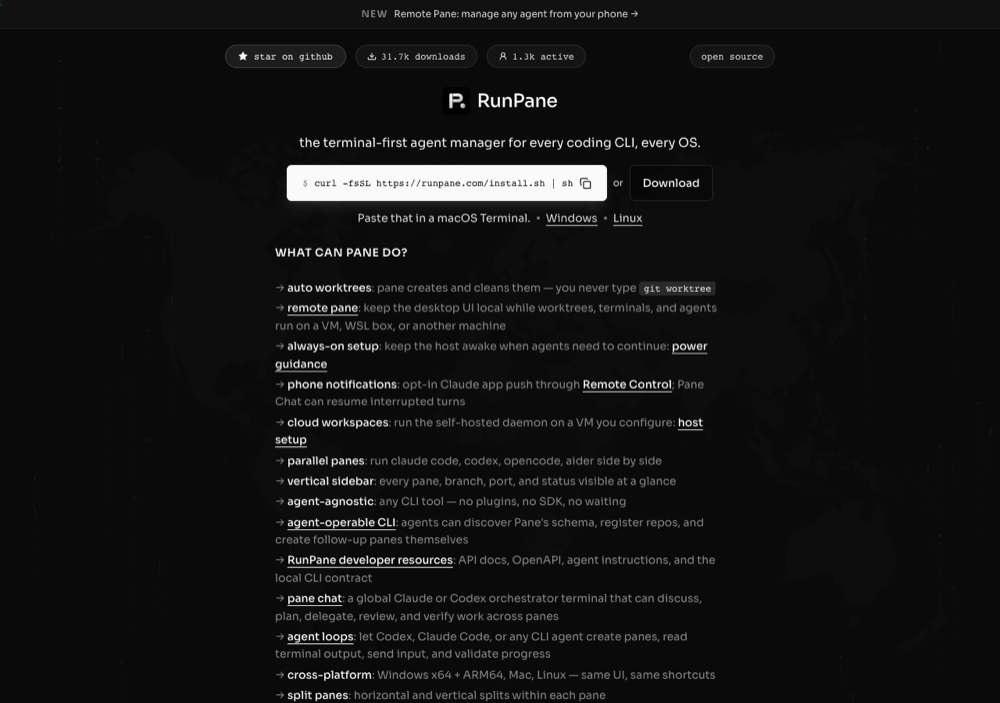

# How the ChatGPT plugin should feel like Pane

Inside ChatGPT the plugin follows OpenAI's UI guidelines for type and color. It uses ChatGPT's system font and system colors for text, icons, backgrounds and dividers. Pane's blue goes only on primary buttons, badges and accents. So the plugin can't look like Pane through fonts or palettes. It looks like Pane through the shapes a Pane user scans all day, through Pane's own icons, through its copy voice, and through real agent content.

## Reference

- The app: [`screenshots/themes/batch/high-legibility.png`](../../screenshots/themes/batch/high-legibility.png) shows the sidebar's repo group, the Pane rows with their `+41 -6` diff stats, the panel tabs, and the terminal block.
- The site: runpane.com, captured on 2026-09-30.

  

- Code: `frontend/src/components/ProjectSessionList.tsx` (Pane row), `ui/AgentStatusDot.tsx` and `ui/agentStatusVisual.ts` (status), `ui/StatusAccentBar.tsx` (row accent), and `styles/tokens/` (tokens).

## Primitives a Pane user recognizes

1. **The Pane row.** A repo header groups the rows. Each row has a git-branch icon, which becomes a pull-request icon once the branch has a PR. Next comes the Pane name, which turns into the PR title when there is one. A small metadata line below reads `#863 +41 -6`. The PR icon's color shows PR state: open is green, merged purple, closed red.
2. **Agent status as a dot.** Working is a blue spinner. Blocked is a pulsing red dot that means the agent needs you. Idle is a calm green dot. A finished turn you haven't looked at yet gets a blue dot and a dashed underline. A plain shell gets no badge. Rows also carry a 4px status accent bar on the left, with a moving sheen while the agent works. The footprint never changes when the status flips.
3. **The terminal.** A block with a `>_ terminal` header, set in monospace, showing the agent's last lines. It's the live heartbeat of an agent.
4. **`pane://` links and Open in Pane.** Every Pane, panel and repo is one click from the app.
5. **The PR.** `#number`, its title and its state, plus the commit and file counts in the Changes view.

## Core journeys, ranked

1. **Start agents.** "Start a Codex agent in web to fix the flaky login test" leads to a new Pane row that starts working.
2. **Watch status and screens.** Which agents work, which are blocked and need me, which are done, and what each one says on screen.
3. **Answer or follow up.** Reply to a blocked agent or send the next instruction, then see that it was delivered.
4. **See the PRs.** Which Panes have PRs, their state, and the diff size, then open the PR or the Pane.

## Copy voice

From the site and the app: terse, concrete, and lowercase-friendly ("auto worktrees", "breathing active panes, and dashed return markers"). It talks in terms of panes, agents, branches and PRs. Labels are short: `working`, `blocked`, `idle`, `done`, `Open in Pane`. Empty states point to the next action in one line ("No agents in this chat yet. Ask ChatGPT to start one.").

## What we reuse, and how

| Pane source | In ChatGPT |
| --- | --- |
| Status semantics (`agentStatusVisual`): working blue spinner, blocked red pulse, idle green, done blue, unknown none | Same shapes and motion, colored with the host's `--color-text-info`, `--color-text-danger` and `--color-text-success` |
| Row layout (`ProjectSessionList` row, two-line layout) | Same structure: icon, title, metadata line, accent bar |
| Icons: lucide `GitBranch`, `GitPullRequest`, `GitPullRequestDraft`, `SquareTerminal` | Same lucide paths, inlined as SVG and drawn in `currentColor` |
| PR state colors (green, purple, red) | Applied as accents on the PR icon and badge only |
| Interactive blue `#1f6feb` (light) and `#58a6ff` text on dark | The primary button and badges, which counts as a brand accent |
| Geist Mono, theme backgrounds | Not used. The system font is `--font-sans`, the terminal uses `--font-mono`, and backgrounds come from the host |
